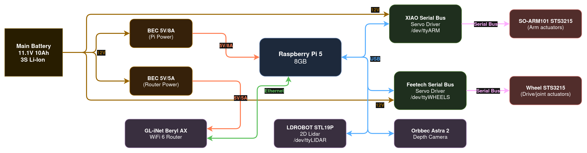

# Nano ATRV

[](https://opensource.org/licenses/MIT)

An articulated diff drive robot for robotics research.


## Electronics Overview

<picture>
  <source media="(prefers-color-scheme: dark)" srcset="nano_atrv/docs/figs/nano_atrv_electronics.png">
  <source media="(prefers-color-scheme: light)" srcset="nano_atrv/docs/figs/nano_atrv_electronics_light.png">
  
</picture>

The power draw of the whole system is an average 1.5A at 12V when idle, about 2.5A when moving, which should equal about 3-5h of runtime on the 90Wh battery.

## Network Setup

* **Router (Beryl AX):** `192.168.8.1/24`

* **Pi eth0:** `192.168.8.8` (connected to router)

* **Pi wlan0 (AP):** `10.42.0.1/24`

* **SSIDs (Router):** `NanoATRV`, `NanoATRV_5Ghz` → access Pi at `192.168.8.8`

* **SSID (Pi AP):** `NanoATRV_Pi_AP` → access Pi at `10.42.0.1`

## Run

If everything is set up correctly, there should be a systemd service running that starts [the nano_atrv_bringup boot launch](https://github.com/vicoslab/nano_atrv/blob/jazzy/nano_atrv_bringup/launch/boot.launch.xml):  

```xml
<!-- Robot model and odometry-->
<include file="$(find-pkg-share nano_atrv_description)/launch/description.launch.xml"/>

<!-- Wheel control -->
<include file="$(find-pkg-share nano_atrv_motor)/launch/wheel_servo.launch.xml"/> 

<!-- Sensors -->
<include file="$(find-pkg-share nano_atrv_bringup)/launch/astra2.launch.py"/>
<include file="$(find-pkg-share nano_atrv_bringup)/launch/lidar.launch.xml"/> 

<!-- Visualizaton -->
<include file="$(find-pkg-share vizanti_server)/launch/vizanti_rws.launch.py"/>
```

This should immediately set up the basic hardware drivers, odometry, and visualization. See [the systemd doc about that](nano_atrv/docs/systemd_services.md) for more info.

The web ui can be accessed at `http:/192.168.8.8:5000` (router) or `http:/10.42.0.1:5000` (Pi hotspot).

Additonal launch files can be started on demand:

```bash
#slam toolbox
ros2 launch nano_atrv_nav slam.launch.py

#amcl + vicos lab map:
ros2 launch nano_atrv_nav loc.launch.py

#nav2 with pure pursuit
ros2 launch nano_atrv_nav nav2.launch.py
```

## Installation

To set up the Pi 5, follow the [ubuntu image customization guide](nano_atrv/docs/pi_setup.md).

Python libs that aren't on apt:
```bash
sudo apt install python3-pip
pip install vassar-feetech-servo-sdk pymunk ikpy --break-system-packages
```

ROS packages:
```bash
cd ~/colcon_ws/src
git clone -b jazzy https://github.com/vicoslab/nano_atrv.git

# LD19 lidar
git clone https://github.com/MoffKalast/ldlidar_stl_ros2.git

# Visualization & Control
git clone -b ros2 https://github.com/MoffKalast/vizanti.git
git clone -b jazzy https://github.com/v-kiniv/rws.git

cd ..
rosdep install -i --from-path src/vizanti -y
rosdep install -i --from-path src/rws -y
colcon_make
```

Install the [Orbbec ROS 2 SDK](https://github.com/orbbec/OrbbecSDK_ROS2) for the Astra 2:

```bash
sudo apt install libgflags-dev nlohmann-json3-dev \
ros-jazzy-image-transport ros-jazzy-image-transport-plugins ros-jazzy-compressed-image-transport \
ros-jazzy-image-publisher ros-jazzy-camera-info-manager \
ros-jazzy-diagnostic-updater ros-jazzy-diagnostic-msgs ros-jazzy-statistics-msgs ros-jazzy-xacro \
ros-jazzy-backward-ros libdw-dev libssl-dev mesa-utils libgl1 libgoogle-glog-dev \
ros-jazzy-orbbec-camera ros-jazzy-orbbec-description
```

### Udev Rules

Rules for mapping devices to consistent paths.

Orbbec udev rules:
```bash
sudo cp /opt/ros/jazzy/share/orbbec_camera/udev/99-obsensor-libusb.rules /etc/udev/rules.d/
```

Lidar, SO-ARM, wheel servos board.

```bash
sudo cp /home/vicos/colcon_ws/src/nano_atrv/nano_atrv_bringup/udev/99-robot-serial.rules /etc/udev/rules.d/
```

Reload udevadm:
```bash
sudo udevadm control --reload-rules && sudo udevadm trigger
```

Check if devices are all there:
```bash
ls -la /dev/ttyWHEELS /dev/ttyLIDAR /dev/ttyARM
lrwxrwxrwx 1 root root 7 Mar 26 13:11 /dev/ttyARM -> ttyACM0
lrwxrwxrwx 1 root root 7 Mar 26 13:11 /dev/ttyLIDAR -> ttyUSB1
lrwxrwxrwx 1 root root 7 Mar 26 13:11 /dev/ttyWHEELS -> ttyUSB0
```

```bash
ros2 run orbbec_camera list_devices_node
USB port_id: 5-1-2
Modified USB port_id: 5-1
[INFO] [1774527241.414957460] [list_device_node]: - Name: Orbbec Astra2, PID: 0x0660, SN/ID: AARW74100ED, Connection: USB3.0
[INFO] [1774527241.414993201] [list_device_node]: serial: AARW74100ED
[INFO] [1774527241.415003941] [list_device_node]: usb port: 5-1
[INFO] [1774527241.415014404] [list_device_node]: usb connect type: USB3.0
```

